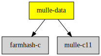

# mulle-data

#### #️⃣ A collection of hash functions

* bit avalance for integers and pointers
* FNV1A for hashing strings for hashtables
* farmhash for (large) data

It contains the convenient `struct mulle_data` to keep `bytes` and
`length` together and to pass it around.

And it contains `struct mulle_range`, which represents ranges of data with
a location (offset) and a length.


| Release Version
|-----------------------------------
|  [](https://github.com/mulle-c/mulle-data/actions)


### Hash functions

*mulle-data* uses various hash algorithms, which are not compatible with
each other. You can compare the hashes of two strings, but you can not compare
the returned hash by `_mulle_hash_string` for `"foo"` and the hash of
`mulle_data_hash( mulle_data_make( "foo", 4))` as one is using FNV1A and the
other is Farmhash (at time of writing).

The returned hash is of `uintptr_t` size, which should be a convenient size
for hash tables.


| Function               | Description
|------------------------|------------------------------
| `mulle_hash`           | hash a memory block
| `mulle_integer_hash`   | hash an integer value
| `mulle_pointer_hash`   | hash an pointer
| `mulle_float_hash`     | hash a `float`  floating point value
| `mulle_double_hash`    | hash a `double` floating point value
| `mulle_long_long_hash` | hash a `long long` integer value
| `mulle_hash_pointer`   | hash a pointer.
| `mulle_hash_string`    | hash a C string
| `mulle_data_hash`      | hash a mulle_data memory block


### You are here




## Add

### Either: link library

Use [mulle-sde](//github.com/mulle-sde) to add mulle-buffer to your project:

```
mulle-sde dependency add --c --marks no-cmake-inherit --github mulle-c mulle-buffer
```

### Or: add Sources

Alternatively you can read [STEAL.md](//github.com/mulle-c11/dox/STEAL.md) on
how to add mulle-c source code into your own projects.


## Install

### mulle-sde

Use [mulle-sde](//github.com/mulle-sde) to build and install mulle-data
and all its dependencies:

```
mulle-sde install --prefix /usr/local \
   https://github.com/mulle-c/mulle-data/archive/latest.tar.gz
```

### Manual Installation


Install the requirements:

Requirements                                | Description
--------------------------------------------|-----------------------
[mulle-c11](//github.com/mulle-c/mulle-c11) | C compiler glue
[farmhash](//github.com/mulle-c/farmhash)   | Data hash function

Install into `/usr/local`:

```
mkdir build 2> /dev/null
(
   cd build ;
   cmake -DCMAKE_INSTALL_PREFIX=/usr/local \
         -DCMAKE_PREFIX_PATH=/usr/local \
         -DCMAKE_BUILD_TYPE=Release .. ;
   make install
)
```
