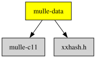

# mulle-data

#### #️⃣  A collection of hash functions

* bit avalance for integers and pointers
* FNV1A for hashing strings for hashtables
* [xxHash](https://github.com/Cyan4973/xxHash) 0.8.3 for (large) data

It contains the convenient `struct mulle_data` to keep `bytes` and
`length` together and to pass it around.

And it contains `struct mulle_range`, which represents ranges of data with
a location (offset) and a length.


| Release Version                                       | Release Notes  | AI Documentation
|-------------------------------------------------------|----------------|---------------
|  [](//github.com/mulle-c/mulle-data/actions)  | [RELEASENOTES](RELEASENOTES.md) | [DeepWiki for mulle-data](https://deepwiki.com/mulle-c/mulle-data)


## API

| Documentation                     | Description
|-----------------------------------|-------------------
| [mulle-data](dox/API_DATA.md)     | `struct mulle_data` holds a pointer to a block of memory (`void *bytes`) and its length in bytes (`size_t length`).
| [mulle-fnv1a](dox/API_FNV1A.md)   | FNV-1a  is a fast, non-cryptographic hash that provides good distribution and low collisions for strings
| [mulle-hash](dox/API_HASH.md)     | xxHash and MurmurHash3 avalanche for fast, efficient, and high-quality hashes of arbitrary data
| [mulle-prime](dox/API_PRIME.md)   | Prime number support for hashtables
| [mulle-range](dox/API_RANGE.md)   | `struct mulle_range` defines a range with a location and length


## Thread Safety

All functions in mulle-data are reentrant and thread-safe, as long as each
`void **state_p` used with `mulle_hash_chained` is confined to a single
thread. There is no shared mutable state.

## Documentation & Guides

* [API Summary](asset/dox/api/toc)


### You are here




## Add

mulle-data is a component of the [mulle-core](//github.com/mulle-core/mulle-core) library. So in your code include the mulle-core umbrella header:

``` c
#include <mulle-core/mulle-core.h>
```

### Add mulle-core to a cmake and git project

``` bash
git submodule add https://github.com/mulle-core/mulle-core.git mulle-core
```

Add this to your `CMakeLists.txt`:

``` cmake
add_subdirectory( mulle-core)
target_link_libraries( ${PROJECT_NAME} PRIVATE mulle-core)
```


### Add mulle-core to a mulle-sde project

``` sh
mulle-sde add github:mulle-core/mulle-core
```

### Embed mulle-data with clib

``` sh
clib install --out src mulle-c/mulle-data
```

Append `src` to your include path (e.g. add `-isystem src`  to your `CFLAGS`)
and compile all the sources that were downloaded.


## Author

[Nat!](https://mulle-kybernetik.com/weblog) for Mulle kybernetiK  


