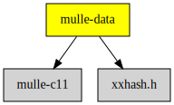

# mulle-data

#### #️⃣  A collection of hash functions

* bit avalance for integers and pointers
* FNV1A for hashing strings for hashtables
* farmhash for (large) data

It contains the convenient `struct mulle_data` to keep `bytes` and
`length` together and to pass it around.

And it contains `struct mulle_range`, which represents ranges of data with
a location (offset) and a length.


| Release Version                                       | Release Notes  | AI Documentation
|-------------------------------------------------------|----------------|---------------
|  [](//github.com/mulle-c/mulle-data/actions)  | [RELEASENOTES](RELEASENOTES.md) | [DeepWiki for mulle-data](https://deepwiki.com/mulle-c/mulle-data)


## API

| Documentation                     | Description
|-----------------------------------|-------------------
| [mulle-data](dox/API_DATA.md)     | `struct mulle_data` holds a pointer to a block of memory (`void *bytes`) and its length in bytes (`size_t length`).
| [mulle-fnv1a](dox/API_FNV1A.md)   | FNV-1a  is a fast, non-cryptographic hash that provides good distribution and low collisions for strings
| [mulle-hash](dox/API_HASH.md)     | MurmurHash3 and FarmHash for fast, efficient, and high-quality hashes of arbitraty data
| [mulle-prime](dox/API_PRIME.md)   | Prime number support for hashtables
| [mulle-range](dox/API_RANGE.md)   | `struct mulle_range` defines a range with a location and length


### You are here




## Quickstart

Install [mulle-core developer](https://github.com/MulleFoundation/foundation-developer?tab=readme-ov-file#install)
then:


``` sh
mulle-sde init -d my-project -m mulle-core/c-developer executable
cd my-project
mulle-sde run
```

## Add

**This project is a component of the [mulle-core](//github.com/mulle-core/mulle-core) library. As such you usually will *not* add or install it
individually, unless you specifically do not want to link against
`mulle-core`.**


### Add as an individual component

Use [mulle-sde](//github.com/mulle-sde) to add mulle-data to your project:

``` sh
mulle-sde add github:mulle-c/mulle-data
```

To only add the sources of mulle-data with dependency
sources use [clib](https://github.com/clibs/clib):


``` sh
clib install --out src/mulle-c mulle-c/mulle-data
```

Add `-isystem src/mulle-c` to your `CFLAGS` and compile all the sources that were downloaded with your project.


## Install

Use [mulle-sde](//github.com/mulle-sde) to build and install mulle-data and all dependencies:

``` sh
mulle-sde install --prefix /usr/local \
   https://github.com/mulle-c/mulle-data/archive/latest.tar.gz
```

### Legacy Installation

Install the requirements:

| Requirements                                 | Description
|----------------------------------------------|-----------------------
| [mulle-c11](https://github.com/mulle-c/mulle-c11)             | 🔀 Cross-platform C compiler glue (and some cpp conveniences)

Download the latest [tar](https://github.com/mulle-c/mulle-data/archive/refs/tags/latest.tar.gz) or [zip](https://github.com/mulle-c/mulle-data/archive/refs/tags/latest.zip) archive and unpack it.

Install **mulle-data** into `/usr/local` with [cmake](https://cmake.org):

``` sh
PREFIX_DIR="/usr/local"
cmake -B build                               \
      -DMULLE_SDK_PATH="${PREFIX_DIR}"       \
      -DCMAKE_INSTALL_PREFIX="${PREFIX_DIR}" \
      -DCMAKE_PREFIX_PATH="${PREFIX_DIR}"    \
      -DCMAKE_BUILD_TYPE=Release &&
cmake --build build --config Release &&
cmake --install build --config Release
```


## Author

[Nat!](https://mulle-kybernetik.com/weblog) for Mulle kybernetiK  


